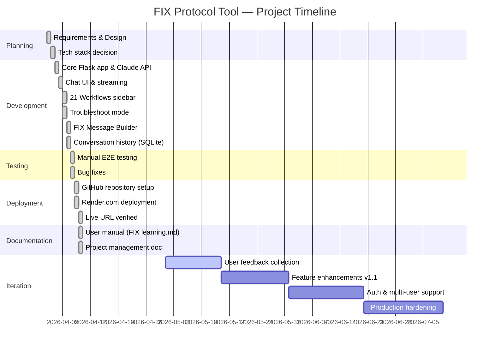

# FIX Protocol Learning & Troubleshooting Tool
## Project Management Document

**Project Name:** FIX Protocol Learning & Troubleshooting Tool  
**Version:** 1.0  
**Date:** April 2026  
**Owner:** Ken Jiang  
**Status:** Active

---

## Table of Contents
1. [Business Justification](#1-business-justification)
2. [Return on Investment (ROI)](#2-return-on-investment-roi)
3. [RACI Matrix](#3-raci-matrix)
4. [Definition of Ready](#4-definition-of-ready)
5. [Definition of Done](#5-definition-of-done)
6. [Milestones](#6-milestones)
7. [Feature Prioritisation — RICE Model](#7-feature-prioritisation--rice-model)
8. [Testing Plan](#8-testing-plan)
9. [Software SDLC](#9-software-sdlc)
10. [Gantt Chart](#10-gantt-chart)

---

## 1. Business Justification

### Problem Statement
FIX (Financial Information Exchange) protocol is the backbone of electronic trading across global capital markets. Fintech professionals — including developers, support engineers, and operations staff — frequently encounter challenges such as:

- **Steep learning curve** — FIX has 21 trading workflows, hundreds of tags, and version differences (4.2, 4.4, 5.0 SP2) that take months to master through traditional documentation
- **Slow troubleshooting** — Diagnosing session failures, sequence number gaps, or message rejections requires deep expertise and often escalation to senior engineers
- **Knowledge silos** — FIX expertise is concentrated in a few individuals; when they leave, institutional knowledge is lost
- **Costly support** — Every unresolved FIX connectivity issue delays trading, causing revenue loss and client dissatisfaction

### Solution
An AI-powered, browser-based tool that provides instant FIX protocol guidance, workflow reference, and real-time troubleshooting — accessible to all levels of staff without requiring deep FIX expertise.

### Strategic Alignment
| Strategic Goal | How This Tool Supports It |
|---|---|
| Reduce operational risk | Faster incident resolution reduces trading downtime |
| Staff development | Junior engineers become productive faster |
| Client satisfaction | Quicker FIX connectivity support for counterparties |
| Knowledge retention | AI encodes institutional FIX knowledge permanently |
| Cost efficiency | Reduces escalation to senior engineers |

### Stakeholders
| Stakeholder | Role | Interest |
|---|---|---|
| Fintech Developers | Primary users | Faster FIX development and debugging |
| Operations / Support | Primary users | Real-time troubleshooting during incidents |
| Senior Engineers | Secondary users | Reduced escalation burden |
| Management | Sponsor | Cost reduction and risk mitigation |
| Clients / Counterparties | Indirect beneficiaries | Faster FIX connectivity resolution |

### Expected Outcomes

Outcomes are organised across three dimensions: **People**, **Process**, and **Business** — aligned to the tool's core purpose.

#### People Outcomes
| Outcome | Baseline (Before) | Target (After) | Timeframe |
|---|---|---|---|
| Junior engineer independently resolves FIX incidents | Requires escalation ~80% of the time | Resolves independently 70% of the time | 3 months post-launch |
| Onboarding time to FIX productivity | 3 months to handle first FIX issue alone | 4 weeks | First cohort of new hires |
| Senior engineer time spent on FIX escalations | ~8 hrs/week answering junior queries | < 3 hrs/week | 2 months post-launch |
| Staff confidence with FIX protocol | Self-reported: 3/10 average | Self-reported: 7/10 average | 6 months post-launch |

#### Process Outcomes
| Outcome | Baseline (Before) | Target (After) | Timeframe |
|---|---|---|---|
| Mean Time to Resolve (MTTR) FIX incidents | ~3 hours per incident | < 1 hour per incident | 3 months post-launch |
| FIX incident escalation rate | ~10 escalations/month | < 6 escalations/month | 3 months post-launch |
| Time to identify correct FIX tag / message type | ~45 mins (manual FIXimate search) | < 5 mins (AI-assisted) | Immediate on launch |
| FIX message validation before sending | Ad hoc, error-prone | Structured builder + AI validation | Immediate on launch |
| Knowledge documented and searchable | Locked in senior engineers' heads | Encoded in AI, accessible 24/7 | Immediate on launch |

#### Business Outcomes
| Outcome | Baseline (Before) | Target (After) | Timeframe |
|---|---|---|---|
| Annual cost of FIX incident resolution | ~$18,000/year in engineer hours | < $9,000/year | 6 months post-launch |
| Client FIX connectivity resolution SLA | 4 hours average | 1 hour average | 3 months post-launch |
| Trading downtime due to FIX errors | ~2 hrs/month unplanned downtime | < 30 mins/month | 6 months post-launch |
| Tool adoption across FIX team | 0% | 80% monthly active users | 2 months post-launch |
| Engineer hours saved per month | 0 hrs | 20+ hrs/month | 1 month post-launch |

#### Outcome Measurement Framework

```
MEASURE → TRACK → REPORT → ITERATE

Monthly review cadence:
  1. Pull JIRA ticket data  → MTTR, escalation rate
  2. Pull Render access logs → Monthly active users
  3. Pull Anthropic API usage → Cost per resolved incident
  4. Quarterly staff survey   → Confidence score, qualitative feedback
  5. Management report        → ROI actuals vs targets
```

---

## 2. Return on Investment (ROI)

### Cost of the Tool

| Cost Item | Estimated Cost |
|---|---|
| Development time (one-time) | ~40 hours of engineering effort |
| Claude API usage (per month) | ~$20–$50 depending on usage volume |
| Hosting on Render.com (per month) | $0 (free tier) to $7 (paid tier) |
| **Total Year 1 cost** | **~$300–$700** |

### Value Generated

| Value Driver | Estimate | Basis |
|---|---|---|
| Reduced time per FIX incident | 2 hrs saved per incident | Average incident takes 3 hrs; tool cuts to 1 hr |
| Incidents per month (team) | ~10 incidents | Typical mid-size trading firm |
| Hours saved per month | 20 hrs/month | 10 incidents × 2 hrs |
| Cost per engineering hour | $75/hr | Mid-level Fintech engineer blended rate |
| **Monthly savings** | **$1,500/month** | |
| **Annual savings** | **$18,000/year** | |

### ROI Calculation

```
ROI = (Annual Savings - Annual Cost) / Annual Cost × 100

ROI = ($18,000 - $600) / $600 × 100 = 2,900%
```

### How to Measure ROI

| Metric | Measurement Method | Target |
|---|---|---|
| Mean Time to Resolve (MTTR) FIX incidents | Track ticket open/close timestamps in JIRA | Reduce by 50% within 3 months |
| Escalation rate to senior engineers | Count escalation tickets per month | Reduce by 40% within 3 months |
| Onboarding time for new hires | Time for new engineer to resolve first FIX issue independently | Reduce from 3 months to 4 weeks |
| User adoption | Monthly active users of the tool | 80% of FIX team within 2 months |
| Client satisfaction | Client-reported FIX connectivity resolution time | Reduce average from 4 hrs to 1 hr |
| API cost per resolved incident | Total API cost ÷ number of incidents resolved | Track monthly |

### Payback Period
At $600/year cost and $18,000/year savings, the tool pays for itself in **less than 2 weeks** of use.

---

## 3. RACI Matrix

### Roles

| Role | Description |
|---|---|
| **PO** — Project Owner | Ken Jiang — accountable for the product vision, priorities, and acceptance |
| **DEV** — Developer | Engineer building and maintaining the tool |
| **SE** — Senior Engineer | FIX subject matter expert providing technical guidance |
| **OPS** — Operations / Support | End users who troubleshoot FIX incidents day-to-day |
| **MGT** — Management | Sponsors who fund and approve the project |
| **USR** — End Users | Developers and support staff using the tool |

### RACI Key
- **R** — Responsible (does the work)
- **A** — Accountable (owns the outcome, signs off)
- **C** — Consulted (provides input before decisions)
- **I** — Informed (kept up to date)

### RACI Table

| Activity | PO | DEV | SE | OPS | MGT | USR |
|---|:---:|:---:|:---:|:---:|:---:|:---:|
| **PLANNING** | | | | | | |
| Define business requirements | A | C | C | C | C | I |
| Approve project scope | A | I | C | I | C | I |
| Technology stack selection | C | A | C | I | I | I |
| Define success metrics / KPIs | A | C | C | C | R | I |
| **DESIGN** | | | | | | |
| UI/UX wireframe design | A | R | I | C | I | C |
| System prompt design (FIX knowledge) | C | R | A | C | I | I |
| API contract design | C | A | C | I | I | I |
| Database schema design | C | A | C | I | I | I |
| **DEVELOPMENT** | | | | | | |
| Backend development (Flask, API) | I | A/R | C | I | I | I |
| Frontend development (UI, Builder) | I | A/R | I | C | I | C |
| Claude AI integration | I | A/R | C | I | I | I |
| FIX workflow content (21 workflows) | C | R | A | C | I | I |
| Troubleshoot mode logic | C | R | A | C | I | C |
| Conversation history (SQLite) | I | A/R | I | I | I | I |
| **TESTING** | | | | | | |
| Write unit tests | I | A/R | C | I | I | I |
| Execute integration tests | I | A/R | C | I | I | I |
| User acceptance testing (UAT) | A | C | C | R | I | R |
| Security review (API key, secrets) | A | R | C | I | I | I |
| Performance testing | C | A/R | I | I | I | I |
| **DEPLOYMENT** | | | | | | |
| GitHub repository setup | I | A/R | I | I | I | I |
| Render.com deployment configuration | I | A/R | I | I | I | I |
| Environment variable management | A | R | I | I | I | I |
| Production go-live approval | A | C | C | I | C | I |
| **DOCUMENTATION** | | | | | | |
| User manual (FIX learning.md) | A | R | C | C | I | I |
| Project management document | A | R | C | I | C | I |
| Release notes | C | A/R | I | I | I | I |
| **MAINTENANCE & OPERATIONS** | | | | | | |
| Monitor API usage and costs | A | R | I | I | I | I |
| Incident response (app downtime) | A | R | C | I | I | I |
| Feature enhancement prioritisation | A | C | C | C | C | R |
| Dependency / security updates | C | A/R | C | I | I | I |
| User feedback collection | A | C | I | R | I | R |

### RACI Summary by Role

| Role | Primary Responsibilities |
|---|---|
| **Project Owner (PO)** | Accountable for scope, priorities, go-live decisions, and success metrics |
| **Developer (DEV)** | Responsible for all technical build, testing, deployment, and maintenance |
| **Senior Engineer (SE)** | Accountable for FIX protocol accuracy in workflows, prompts, and content |
| **Operations / Support (OPS)** | Consulted on troubleshooting requirements; performs UAT; collects user feedback |
| **Management (MGT)** | Consulted on business requirements and ROI; informed of milestones and costs |
| **End Users (USR)** | Consulted on UI/UX; performs UAT; primary source of feature feedback |

---

## 4. Definition of Ready

A user story or feature is **ready to be worked on** when all of the following criteria are met:

### User Story Criteria
- [ ] User story is written in the format: *"As a [user], I want [feature] so that [benefit]"*
- [ ] Acceptance criteria are clearly defined and testable
- [ ] Story is estimated (story points or time)
- [ ] Dependencies are identified and resolved
- [ ] UI/UX mockup or wireframe is approved (for frontend changes)
- [ ] API contract is agreed (for backend changes)
- [ ] No blockers or open questions remain

### Technical Criteria
- [ ] Development environment is set up and working
- [ ] Required third-party APIs (Anthropic Claude) are accessible
- [ ] Test data or FIX message samples are available
- [ ] Security requirements are understood (API key handling, data privacy)

### Business Criteria
- [ ] Business owner has reviewed and approved the story
- [ ] Priority is confirmed in the backlog
- [ ] Success metrics are defined

---

## 5. Definition of Done

A feature or story is **done** when all of the following are true:

### Code Quality
- [ ] Code is written and peer-reviewed (pull request approved)
- [ ] No hardcoded API keys or secrets in code
- [ ] Code follows project conventions (Python PEP8, clean HTML/JS)
- [ ] No unused imports, dead code, or debug statements left in

### Testing
- [ ] Unit tests written and passing
- [ ] Integration test with Claude API passing
- [ ] Manual end-to-end test completed in browser
- [ ] Tested on Chrome and Edge (minimum)
- [ ] No critical or high-severity bugs open

### Deployment
- [ ] Code merged to `main` branch on GitHub
- [ ] Successfully deployed to Render.com
- [ ] Live URL verified and accessible
- [ ] Environment variables confirmed set on Render

### Documentation
- [ ] `FIX learning.md` updated if user-facing behaviour changed
- [ ] `README.md` updated if setup steps changed
- [ ] Code comments added for non-obvious logic

### Acceptance
- [ ] Product owner (Ken Jiang) has reviewed and accepted the feature on the live app
- [ ] No regression in existing features

---

## 6. Milestones

| # | Milestone | Description | Target Date | Status |
|---|---|---|---|---|
| M1 | Project Kickoff | Requirements defined, tech stack chosen, repo created | Apr 2026 | ✅ Complete |
| M2 | Core Chat MVP | Working Flask app with Claude AI chat, basic UI | Apr 2026 | ✅ Complete |
| M3 | Full Feature Release | 21 workflows sidebar, troubleshoot mode, FIX builder, history | Apr 2026 | ✅ Complete |
| M4 | Cloud Deployment | App live on Render.com with public URL | Apr 2026 | ✅ Complete |
| M5 | Documentation | User manual and project management doc complete | Apr 2026 | ✅ Complete |
| M6 | User Feedback & Iteration | Gather feedback from 3+ users, implement top issues | May 2026 | 🔄 Planned |
| M7 | Enhanced Features | Auth/login, multi-user support, FIX message log parser | Jun 2026 | 🔄 Planned |
| M8 | Production Hardening | Rate limiting, error monitoring, uptime alerting | Jul 2026 | 🔄 Planned |

---

## 7. Feature Prioritisation — RICE Model

### What is RICE?

RICE is a prioritisation framework that scores each feature request using four factors, ensuring enhancements are chosen based on value to outcomes — not gut feel or loudest voice.

```
RICE Score = (Reach × Impact × Confidence) / Effort
```

| Factor | Definition | Scale |
|---|---|---|
| **Reach** | How many users benefit per month | Number of users (e.g. 10, 50, 200) |
| **Impact** | How much it improves the outcome per user | 3 = Massive, 2 = High, 1 = Medium, 0.5 = Low, 0.25 = Minimal |
| **Confidence** | How certain we are about Reach and Impact estimates | 100% = High, 80% = Medium, 50% = Low |
| **Effort** | Total person-months of work required | Person-months (e.g. 0.5, 1, 2) |

### Outcome Alignment

Each feature is tagged to the Outcome it primarily drives:

| Tag | Outcome |
|---|---|
| 🟢 **MTTR** | Reduces Mean Time to Resolve FIX incidents |
| 🔵 **ADOPT** | Increases tool adoption and daily usage |
| 🟡 **LEARN** | Accelerates FIX learning and staff upskilling |
| 🟠 **CLIENT** | Improves client / counterparty experience |
| 🔴 **COST** | Reduces operational cost or API spend |

---

### RICE Prioritisation Table

| # | Feature Request | Reach | Impact | Confidence | Effort | **RICE Score** | Outcome Tag | Priority |
|---|---|:---:|:---:|:---:|:---:|:---:|---|---|
| 1 | **FIX Message Log Parser** — paste a raw FIX log; AI parses and explains each message | 40 | 3 | 80% | 1.0 | **96** | 🟢 MTTR | 🥇 High |
| 2 | **User Authentication / Login** — personal accounts so each user has private history | 50 | 2 | 80% | 2.0 | **40** | 🔵 ADOPT | 🥇 High |
| 3 | **Saved FIX Message Templates** — save frequently used message structures in the builder | 30 | 2 | 100% | 0.5 | **120** | 🟢 MTTR | 🥇 High |
| 4 | **FIX Tag Search** — type a tag number or name; get instant definition and usage | 50 | 2 | 100% | 0.5 | **200** | 🟡 LEARN | 🥇 High |
| 5 | **Error Code Quick Reference** — searchable table of all FIX reject reason codes | 40 | 2 | 100% | 0.5 | **160** | 🟢 MTTR | 🥇 High |
| 6 | **Session Diff Tool** — compare two FIX sessions side by side to spot config differences | 20 | 3 | 80% | 1.5 | **32** | 🟢 MTTR | 🥈 Medium |
| 7 | **Multi-user Support** — teams share one instance with user roles | 50 | 2 | 80% | 3.0 | **27** | 🔵 ADOPT | 🥈 Medium |
| 8 | **Export Chat to PDF** — download conversation as a formatted PDF report | 30 | 1 | 100% | 0.5 | **60** | 🟠 CLIENT | 🥈 Medium |
| 9 | **FIX Version Comparison** — side-by-side tag differences between FIX 4.2, 4.4, 5.0 SP2 | 25 | 2 | 80% | 1.0 | **40** | 🟡 LEARN | 🥈 Medium |
| 10 | **Sequence Number Calculator** — tool to calculate correct resend range from logs | 20 | 3 | 80% | 0.5 | **96** | 🟢 MTTR | 🥇 High |
| 11 | **Onboarding Quiz Mode** — test FIX knowledge with scored multiple-choice questions | 15 | 2 | 80% | 1.5 | **16** | 🟡 LEARN | 🥉 Low |
| 12 | **Usage Analytics Dashboard** — show most asked topics, MTTR trend, adoption stats | 10 | 1 | 80% | 1.0 | **8** | 🔴 COST | 🥉 Low |
| 13 | **Slack / Teams Notification** — alert ops team when a new troubleshoot session starts | 15 | 1 | 50% | 1.0 | **8** | 🟠 CLIENT | 🥉 Low |
| 14 | **Dark / Light Theme Toggle** — UI theme preference | 50 | 0.25 | 100% | 0.25 | **50** | 🔵 ADOPT | 🥈 Medium |

### RICE Score Calculation Examples

**Feature 4 — FIX Tag Search:**
```
RICE = (50 × 2 × 100%) / 0.5 = 200  ← Highest priority
```

**Feature 5 — Error Code Quick Reference:**
```
RICE = (40 × 2 × 100%) / 0.5 = 160
```

**Feature 3 — Saved FIX Message Templates:**
```
RICE = (30 × 2 × 100%) / 0.5 = 120
```

### Recommended Development Sequence (by RICE Score)

```
Sprint 1 (May 2026)
  ├── Feature 4: FIX Tag Search             RICE: 200  🟡 LEARN
  └── Feature 5: Error Code Quick Reference RICE: 160  🟢 MTTR

Sprint 2 (May–Jun 2026)
  ├── Feature 3: Saved FIX Message Templates RICE: 120  🟢 MTTR
  └── Feature 1: FIX Message Log Parser      RICE: 96   🟢 MTTR

Sprint 3 (Jun 2026)
  ├── Feature 10: Sequence Number Calculator RICE: 96   🟢 MTTR
  └── Feature 8:  Export Chat to PDF         RICE: 60   🟠 CLIENT

Sprint 4 (Jun–Jul 2026)
  ├── Feature 2:  User Authentication        RICE: 40   🔵 ADOPT
  └── Feature 9:  FIX Version Comparison     RICE: 40   🟡 LEARN
```

> **Note:** RICE scores are reviewed and recalibrated monthly based on actual usage data and user feedback. Features with low RICE scores are not discarded — they are deferred until a higher-priority sprint slot opens.

---

## 8. Testing Plan

### Test Levels

#### Unit Testing
| Component | What to Test | Tool |
|---|---|---|
| `resolve_api_key()` | Returns key from env, file, and prompt paths | pytest |
| `init_db()` | Creates table if not exists; no error on re-run | pytest |
| `/api/history` POST | Saves conversation and returns correct JSON | pytest + Flask test client |
| `/api/history` GET | Returns list of saved conversations | pytest + Flask test client |
| `/api/history/<id>` GET | Returns messages for valid ID; 404 for invalid | pytest + Flask test client |
| `/api/history/<id>` DELETE | Removes record from DB | pytest + Flask test client |

#### Integration Testing
| Test Case | Steps | Expected Result |
|---|---|---|
| Claude API connectivity | Send a simple question via `/api/chat` | Streamed response received within 10s |
| Invalid API key | Set wrong key, send message | Error message shown in chat (not crash) |
| Long conversation | Send 10+ messages in one session | All messages preserved, responses coherent |
| Workflow sidebar click | Click any of the 21 workflow buttons | Question auto-sent and answered correctly |
| Troubleshoot mode | Switch mode, fill form, submit | Structured troubleshooting prompt sent to AI |

#### End-to-End (E2E) Testing
| Scenario | Steps | Pass Criteria |
|---|---|---|
| New user first visit | Open URL, see welcome screen | Welcome screen displays correctly |
| Ask FIX question | Type question, press Enter | AI responds with FIX-relevant answer |
| Use workflow button | Click "07 Single Order" in sidebar | Full order lifecycle explanation returned |
| Build a FIX message | Open builder, select D, add tags | Live preview updates; copy works |
| Validate message | Click "Ask AI to Validate" | AI identifies any missing required tags |
| Save conversation | Click Save, check History tab | Conversation appears in history list |
| Reload conversation | Click saved conversation | Messages reload correctly in chat |
| Delete conversation | Click × on history item | Item removed from list |

#### Performance Testing
| Test | Target |
|---|---|
| First response token (streaming) | < 2 seconds |
| Page load time | < 1.5 seconds |
| Render.com cold start (after idle) | < 40 seconds |
| Concurrent users (free tier) | 5 simultaneous users without error |

#### Security Testing
| Test | Check |
|---|---|
| API key not exposed | `.api_key` file in `.gitignore`; not in GitHub repo |
| No secrets in responses | AI never returns the API key in any response |
| Input validation | Very long inputs handled gracefully (no server crash) |
| HTTPS enforced | Render.com provides TLS automatically |

### Test Environment
| Environment | URL | Purpose |
|---|---|---|
| Local | http://localhost:5000 | Development and unit testing |
| Production | https://fix-protocol-tool.onrender.com | E2E and user acceptance testing |

---

## 9. Software SDLC

This project follows an **Agile / iterative SDLC** model with short sprints.

### Phase 1 — Planning
**Activities:**
- Define business problem and goals
- Identify stakeholders and users
- Choose technology stack (Python, Flask, Claude API, Render)
- Create project backlog and prioritise features
- Define Definition of Ready and Definition of Done

**Outputs:** Business justification, tech stack decision, initial backlog

---

### Phase 2 — Design
**Activities:**
- Design UI wireframes (chat layout, sidebar, builder panel)
- Define API contracts (`/api/chat`, `/api/history`)
- Design data model (SQLite conversations table)
- Define system prompt structure for Claude

**Outputs:** UI mockup, API spec, data schema, system prompt draft

---

### Phase 3 — Development
**Activities:**
- Build Flask backend (`web_app.py`)
- Build frontend UI (`templates/index.html`)
- Integrate Anthropic Claude API with streaming (SSE)
- Implement SQLite conversation history
- Implement FIX Message Builder
- Implement Troubleshoot mode form

**Outputs:** Working application on localhost

---

### Phase 4 — Testing
**Activities:**
- Unit test all API routes
- Integration test Claude API connectivity
- Manual E2E testing in browser
- Security check (API key handling, .gitignore)
- Cross-browser testing (Chrome, Edge)

**Outputs:** Test results, bug list, fixes applied

---

### Phase 5 — Deployment
**Activities:**
- Push code to GitHub
- Configure Render.com web service
- Set environment variable `ANTHROPIC_API_KEY` on Render
- Verify live URL is accessible and functional
- Monitor first 24 hours for errors

**Outputs:** Live app at https://fix-protocol-tool.onrender.com

---

### Phase 6 — Maintenance & Iteration
**Activities:**
- Collect user feedback
- Monitor API usage and costs
- Prioritise and implement enhancement requests
- Update system prompt as FIX knowledge expands
- Apply security patches and dependency updates

**Outputs:** New releases, updated documentation

### Technology Stack Summary

| Layer | Technology | Reason |
|---|---|---|
| Language | Python 3.12 | Rapid development, rich ecosystem |
| Web framework | Flask 3.1 | Lightweight, easy to deploy |
| AI engine | Claude claude-haiku-4-5 | Fast, cost-effective, high FIX accuracy |
| Streaming | Server-Sent Events (SSE) | Real-time token streaming to browser |
| Database | SQLite | Zero-config, file-based, sufficient for this scale |
| Frontend | Vanilla HTML/CSS/JS + Marked.js | No build step, fast load, easy to maintain |
| Hosting | Render.com | Free tier, auto-deploy from GitHub |
| Version control | GitHub | Code storage, collaboration, portfolio visibility |

---

## 10. Gantt Chart



> **Note:** This Gantt chart renders as a diagram on GitHub automatically. View it at:
> github.com/ken-jiang-claude/fix-protocol-tool

---

*Document version 1.2 | April 2026 | Ken Jiang*
